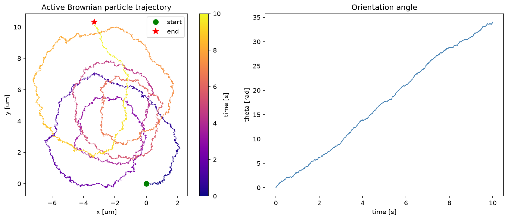
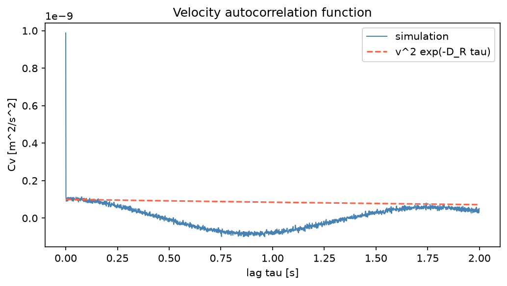
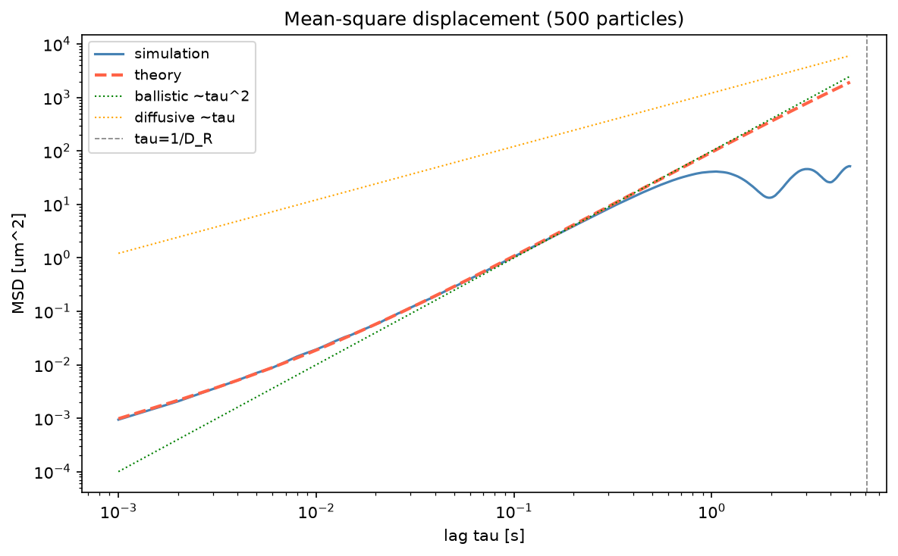
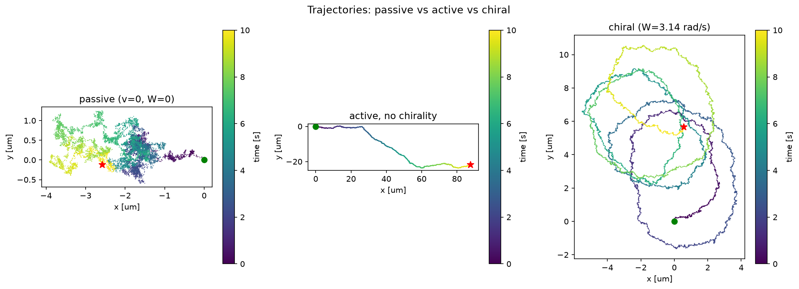

# Active Brownian Motion — Langevin Simulation

A Python simulation of an **active Brownian particle** (ABP / microswimmer) in a homogeneous 2-D environment, based on the overdamped Langevin equations:

$$\dot{x} = v\cos\theta + \sqrt{2D_T}\,\xi_x(t)$$
$$\dot{y} = v\sin\theta + \sqrt{2D_T}\,\xi_y(t)$$
$$\dot{\theta} = \Omega + \sqrt{2D_R}\,\xi_\theta(t)$$

where $\xi$ are independent Gaussian white-noise terms, $D_T$ is the translational diffusion coefficient, $D_R$ is the rotational diffusion coefficient, $v$ is the self-propulsion speed, and $\Omega$ is the angular velocity (chirality).

**Reference:** Volpe et al., *Simulation of the active Brownian motion of microswimmers*, Am. J. Phys. **82**, 659 (2014).

---

## Repository contents

| File | Description |
|---|---|
| `Langevin_simulation.ipynb` | Main notebook — full ABP simulation with all figures |
| `test_brownian.py` | Benchmark test suite (pytest) |
| `Borwnian_Simulation_active_swimmer.m` | Original MATLAB implementation |
| `Lotka_Voltera_Solution.ipynb` | Lotka–Volterra predator-prey dynamics + ML |

---

## Physical parameters

| Quantity | Symbol | Value |
|---|---|---|
| Temperature | $T$ | 300 K |
| Viscosity (water) | $\eta$ | 0.001 Pa·s |
| Particle radius | $R$ | 1 µm |
| Translational diffusion | $D_T$ | 2.20 × 10⁻¹³ m²/s |
| Rotational diffusion | $D_R$ | 0.165 rad²/s |
| Persistence time | $1/D_R$ | ~6.1 s |
| Self-propulsion speed | $v$ | 10 µm/s |
| Angular velocity | $\Omega$ | π rad/s |
| Time step | $dt$ | 1 ms |

---

## Notebook sections

### 1 — Physical parameters & diffusion coefficients
Computes $D_T$ and $D_R$ from the Stokes–Einstein relations and prints key timescales.

### 2 — Single-particle trajectory
Simulates 10 000 steps (10 s). Produces a trajectory scatter plot coloured by time and a plot of the unwrapped orientation angle $\theta(t)$.



### 3 — Velocity autocorrelation function (VACF)
Computes $C_v(\tau) = \langle \mathbf{v}(t)\cdot\mathbf{v}(t+\tau)\rangle$ and compares it to the analytical result $v^2 e^{-D_R\tau}$.



### 4 — Mean-square displacement (MSD) — ensemble average
Runs a vectorised ensemble of 500 particles for 5 000 steps. Plots the simulated MSD against:
- Analytical formula: $\langle r^2\rangle = 4D_T\tau + \frac{2v^2}{D_R^2}[D_R\tau - 1 + e^{-D_R\tau}]$
- Ballistic asymptote: $v^2\tau^2$
- Diffusive asymptote: $4(D_T + v^2/2D_R)\tau$



### 5 — Effect of chirality
Side-by-side trajectory comparison of passive ($v=0$), active non-chiral ($\Omega=0$), and chiral ($\Omega=\pi$ rad/s) particles.



---

## Running the notebook

```bash
pip install numpy matplotlib jupyter
jupyter notebook Langevin_simulation.ipynb
```

Or open directly in Google Colab via the badge at the top of the notebook.

---

## Running the tests

```bash
pip install pytest pytest-benchmark
pytest test_brownian.py -v
```

To include the timing benchmarks:

```bash
pytest test_brownian.py -v --benchmark-only
```

### Test coverage

| Test class | What is verified |
|---|---|
| `TestDiffusionCoefficients` | Stokes–Einstein values for $D_T$, $D_R$; geometric ratio $D_T/D_R = \tfrac{4}{3}R^2$ |
| `TestPassiveDiffusion` | Passive MSD: linear slope at long times; magnitude $4D_T\tau$ |
| `TestActiveDiffusion` | Ballistic MSD slope at short times; ballistic-to-diffusive crossover; match to analytical formula; effective swim diffusivity |
| `TestVACF` | Zero-lag VACF including noise floor; exponential decay rate $\approx D_R$ |
| `TestChiralParticle` | Chiral MSD suppressed vs non-chiral at the half-orbit time $\pi/\Omega$ |
| `TestBenchmark` | Timing benchmarks for single trajectory and ensemble |

---

## Key results

The simulation reproduces all analytical predictions for active Brownian motion:

- **Ballistic regime** ($\tau \ll 1/D_R$): $\langle r^2\rangle \approx v^2\tau^2$ — the particle swims in a nearly straight line.
- **Diffusive crossover** ($\tau \sim 1/D_R$): rotational diffusion randomises the swimming direction.
- **Long-time diffusion**: effective diffusivity $D_\text{eff} = D_T + v^2/(2D_R) \approx 3.04 \times 10^{-10}$ m²/s, ~1400× larger than $D_T$ alone.
- **VACF** decays exponentially at rate $D_R$, confirming the orientational memory timescale.
- **Chirality** ($\Omega \neq 0$) suppresses net displacement at short times as the particle traces circular orbits.
